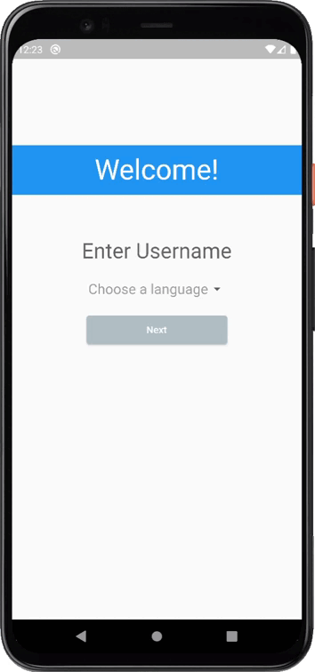

# To-do app

Simple To-do application created with Flutter and Hive.

# Description

* First screen
    * The First screen has a welcome message, language selection, and username input.
    * To get to the second screen you have to fill up all fields from the first screen and then press "Next"

* Second screen
    * The Second screen includes a list of unfinished tasks with possibilities to add, remove and edit tasks.
    * To add a new task press the "+" button on your right bottom corner of the screen.
        * Tasks are stored in Hive database
    * You can go to the third screen by pressing the arrow on the top right corner of the second screen

* Third screen
    * The third screen includes a list of completed tasks
    * You can delete task by pressing "Remove" button
    * To go back to the second screen press the arrow on the top left corner of the screen